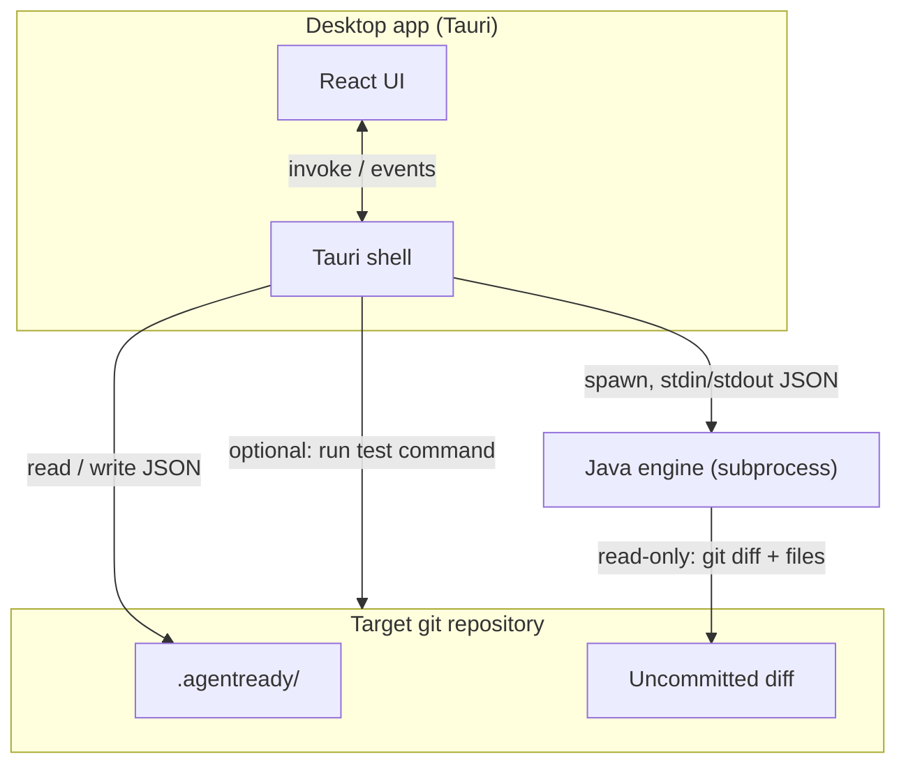
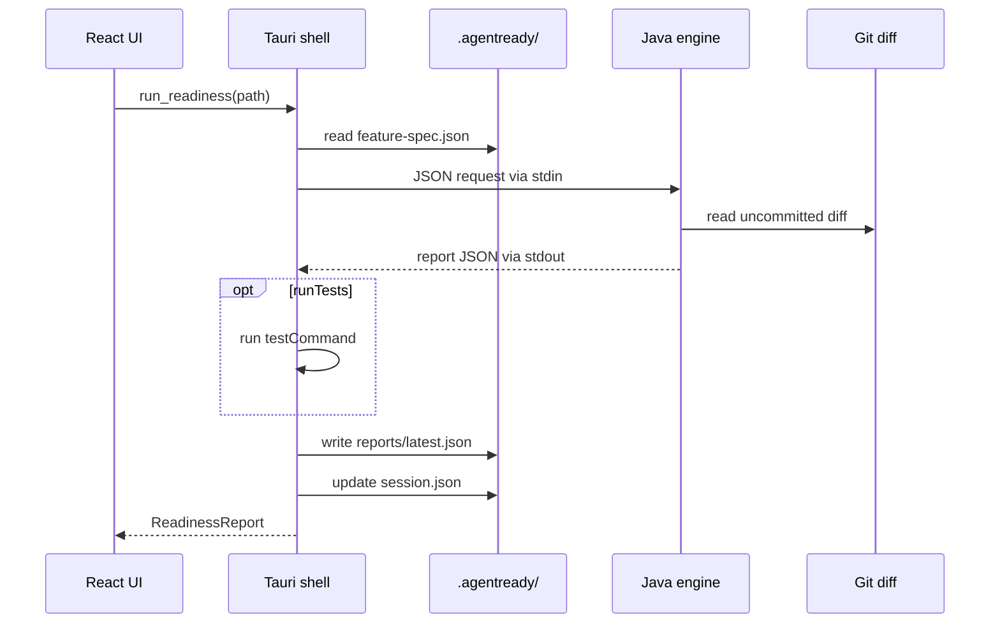

# AgentReady Free v1 — Architecture

## Overview

AgentReady Free v1 verifies **uncommitted AI-generated changes** before commit. Three parts: **Tauri desktop shell** (Rust), **React/TypeScript UI**, and **Java verification engine**. The shell manages process lifecycle, optional test command execution, and `.agentready/` persistence. The engine is stateless, analyzes the git diff read-only, and returns a structured report via JSON.



## Design principles

1. **Local-first** — No network for core flows.
2. **Diff-centric** — Checks target the uncommitted diff, not whole-repo hygiene.
3. **Engine statelessness** — Mutable state in `.agentready/` only; engine is restartable.
4. **Contract-first** — `docs/schemas/` define integration boundaries.
5. **Read-only verification** — Engine never writes to the repo; shell writes only under `.agentready/`.
6. **User commits** — AgentReady never runs `git commit`.

## Module boundaries

### 1. Desktop UI (`apps/desktop/src/`)

**Stack:** React, TypeScript, Vite (bundled by Tauri).

**Responsibilities:**

- Repo picker and session header.
- Feature session form: original request → save spec.
- Trigger readiness check; show progress.
- Render verdict, diff summary, findings, test result, repair prompt.
- Report history list.

**Must not:**

- Spawn the engine or run shell commands directly.
- Implement check logic.
- Persist repo files except via Tauri commands.

---

### 2. Tauri shell (`apps/desktop/src-tauri/`)

**Stack:** Rust (Tauri 2.x).

**Responsibilities:**

- `open_repo(path)` — validate git repo, init `.agentready/`, load session.
- `start_feature_session(path, description)` — create/update feature spec, update session.
- `run_readiness(path)` — load spec, build engine request, spawn engine, optionally run test command, persist report, update session.
- `get_session`, `get_feature_spec`, `save_feature_spec`, `load_report`, `list_reports`.
- Resolve engine JAR and Java runtime path.
- Engine timeout (default 60s, excluding test command).

**Must not:**

- Implement verification rules (delegates to engine).
- Auto-commit or modify tracked project files.

**Tauri commands:**

| Command | Input | Output |
|---------|-------|--------|
| `open_repo` | `{ path }` | `CurrentSession` |
| `start_feature_session` | `{ path, description }` | `FeatureSpec` |
| `run_readiness` | `{ path, runTests?: boolean }` | `ReadinessReport` |
| `get_session` | `{ path }` | `CurrentSession` |
| `get_feature_spec` | `{ path }` | `FeatureSpec \| null` |
| `save_feature_spec` | `{ path, spec }` | `FeatureSpec` |
| `load_report` | `{ path, reportId? }` | `ReadinessReport` |
| `list_reports` | `{ path }` | `{ id, generatedAt, verdict }[]` |

---

### 3. Verification engine (`engine/`)

**Stack:** Java 21+, Maven, fat JAR.

**Responsibilities:**

- Parse JSON request from stdin.
- Resolve uncommitted diff (staged + unstaged) via JGit or `git diff`.
- Run v1 baseline checks against diff hunks and paths.
- Match diff content against feature spec keywords and status codes.
- Compute verdict and generate repair prompt.
- Emit JSON response on stdout; log to stderr.

**Must not:**

- Write files, run git commit, or call network APIs.
- Run test commands (shell responsibility in v1).

**Packages:**

| Package | Role |
|---------|------|
| `io.agentready.engine.cli` | stdin/stdout entrypoint |
| `io.agentready.engine.checks` | One class per check, shared `Check` interface |
| `io.agentready.engine.git` | Diff extraction, branch, dirty state |
| `io.agentready.engine.diff` | Parse paths, classify production vs test, hunk text |
| `io.agentready.engine.spec` | Keyword/status-code matching against spec |
| `io.agentready.engine.report` | Verdict derivation, repair prompt builder |
| `io.agentready.engine.model` | Request/response types |

---

## Engine JSON protocol

### Transport

- **Invocation:** `java -jar agentready-engine.jar`
- **Input:** UTF-8 JSON on stdin (single document, EOF-terminated).
- **Output:** UTF-8 JSON on stdout.
- **stderr:** Diagnostics only.
- **v1:** One request per process invocation.

### Request

```json
{
  "protocolVersion": "1.0",
  "command": "run_readiness",
  "repoPath": "/absolute/path/to/repo",
  "featureSpec": {
    "schemaVersion": "1.0",
    "id": "0b11d4e5-2b3f-4f7f-8b14-3f7d8f4b8e1f",
    "title": "Return 404 for missing users",
    "originalFeatureDescription": "API should return 404 when user id not found",
    "expectedKeywords": ["user", "not found", "404"],
    "expectedStatusCodes": [404],
    "riskKeywords": [],
    "createdAt": "2026-06-06T16:00:00Z",
    "updatedAt": "2026-06-06T16:00:00Z"
  },
  "options": {
    "checkSuite": "free-v1-precommit",
    "largeDiffMaxLines": 2000,
    "largeDiffMaxFiles": 50,
    "includeStaged": true,
    "includeUnstaged": true
  }
}
```

| Field | Required | Notes |
|-------|----------|-------|
| `protocolVersion` | yes | `"1.0"` |
| `command` | yes | v1: `run_readiness` only |
| `repoPath` | yes | Absolute path with `.git` |
| `featureSpec` | no | Omit if no active session spec; when present it should conform to `feature-spec.schema.json` |
| `options` | no | Suite tuning |

### Response (success)

```json
{
  "protocolVersion": "1.0",
  "status": "ok",
  "report": { }
}
```

`report` conforms to `readiness-report.schema.json`.

### Response (error)

```json
{
  "protocolVersion": "1.0",
  "status": "error",
  "error": {
    "code": "INVALID_REPO",
    "message": "Path is not a git repository"
  }
}
```

| Error code | Meaning |
|------------|---------|
| `INVALID_JSON` | Request parse failure |
| `UNSUPPORTED_VERSION` | Unknown `protocolVersion` |
| `UNKNOWN_COMMAND` | Unknown `command` |
| `INVALID_REPO` | Not a git repo or unreadable |
| `NO_DIFF` | No uncommitted changes to analyze |
| `CHECK_FAILED` | Unexpected failure mid-run |
| `INTERNAL` | Unhandled error |

---

## Verdict derivation

Applied by the engine after all checks complete:

| Condition | Verdict |
|-----------|---------|
| Any check `fail` | `NOT_READY` |
| No check `fail`, but test result is `fail` or `error` | `NOT_READY` |
| No `fail`, any `warn`, or optional test `warn` | `NEEDS_REVIEW` |
| All checks `pass` or `skip` (and test passed if run) | `READY_TO_COMMIT` |

`skip` checks do not block `READY_TO_COMMIT`.

---

## Check suite (`free-v1-precommit`)

| ID | Typical fail trigger | Typical warn trigger |
|----|----------------------|----------------------|
| `changed-file-summary` | — | Always informational `pass` with evidence |
| `production-without-tests` | Production paths changed, zero test paths | Heuristic uncertain classification |
| `deleted-test-files` | Any test file deleted | — |
| `config-env-dependency-risk` | — | Matches `.env`, lockfiles, CI config, etc. |
| `hardcoded-secrets` | High-confidence pattern in diff | Possible pattern |
| `large-diff` | — | Over line/file threshold |
| `spec-keyword-match` | Required keywords missing from diff | Partial match |
| `status-code-match` | Expected code absent from diff | — |
| `agentready-ignored` | — | `.agentready/` not in `.gitignore` |

Path classification (production vs test) uses basename/path heuristics (`*Test.*`, `__tests__/`, `spec/`, etc.) — intentionally approximate for cross-repo use.

---

## Test execution (shell)

When `run_readiness` is called with `runTests: true` and `.agentready/config.json` defines `testCommand`:

1. Shell runs engine first (or in parallel — implementation choice).
2. Shell executes `testCommand` in `repoPath` with timeout.
3. Shell merges `testResult` into the persisted report.

Engine does not run tests in v1; keeps sandbox and permissions simpler.

---

## Local storage (`.agentready/`)

```
.agentready/
├── session.json
├── feature-spec.json
├── config.json              # optional: testCommand, diff thresholds
├── reports/
│   ├── latest.json
│   └── 2026-06-06T14-30-00Z.json
└── cache/
    └── .gitkeep
```

### File ownership

| File | Writer | Reader |
|------|--------|--------|
| `session.json` | Shell | Shell, UI |
| `feature-spec.json` | Shell | Shell, UI, engine (via request) |
| `reports/*.json` | Shell | Shell, UI |
| `config.json` | Shell / user | Shell |

### `config.json` (optional v1)

```json
{
  "testCommand": "npm test",
  "largeDiffMaxLines": 2000,
  "largeDiffMaxFiles": 50
}
```

---

## Data flow: readiness run



---

## Repair prompt generation

Engine builds `repairPrompt` from checks with `fail` or `warn`:

- Verdict and one-line summary.
- Bulleted findings with check id, message, and file paths.
- Suggested next steps (add tests, remove secrets, align with spec keywords/codes).
- Plain text, suitable for pasting into an AI agent.

---

## Packaging

| Component | Artifact |
|-----------|----------|
| Desktop | Tauri bundle |
| Engine | `agentready-engine.jar` in app resources |
| Runtime | Bundled JRE (preferred) |

Report echoes `engineVersion` and `checkSuite` (e.g. `free-v1-precommit@1`).

---

## Security

- Engine receives only `repoPath` and spec JSON; no CLI path injection.
- `hardcoded-secrets` may false-positive; never auto-redact.
- Test command comes from repo-local config; user is responsible for trust.

---

## Testing (planned)

| Layer | Approach |
|-------|----------|
| Engine | Per-check unit tests; fixture repos with staged diffs |
| Shell | Spawn engine against temp git repos |
| Schemas | Example reports validate in CI |

---

## Repository layout

```
agentready/
├── apps/desktop/       # Tauri shell + React UI
├── engine/             # Java verification engine
└── docs/               # Scope, architecture, schemas
```

---

## Open decisions

| Topic | Assumption |
|-------|------------|
| Git library | JGit for diff parsing |
| Spec extraction | Shell or engine heuristics on `originalFeatureDescription` |
| `NO_DIFF` | Error vs empty report with verdict `READY_TO_COMMIT` — default: report with skip checks and informational message |
