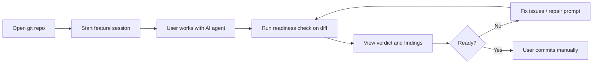

# AgentReady Free v1 — Product Scope

## Summary

AgentReady Free v1 is a **local-first desktop app** that verifies **AI-generated code before commit**. The user opens a git repo, records their original feature request, lets Cursor/Claude/etc. make changes, then runs a **baseline readiness check against the current uncommitted diff**. The app returns a verdict, findings, changed files, optional test results, and a repair prompt. The user fixes issues, reruns, and commits manually outside AgentReady.

**Core question:** *"Is this AI-generated code ready to commit?"*

No signup, no cloud dependency, no auto-commit. Repo-local state lives in `.agentready/`.

## Goals

1. Give developers a fast, offline pre-commit signal on AI-generated diffs.
2. Surface concrete findings (missing tests, risky paths, spec mismatches) and a copy-paste repair prompt.
3. Work on **any git repo** with baseline heuristics — not stack-specific deep analysis.
4. Keep verification logic in the Java engine; UI and shell handle presentation and persistence only.

## User workflow (v1)

1. **Open a git repo** — select a local repository with a `.git` directory.
2. **Start a feature session** — enter the user's original request; app saves a lightweight feature spec and seeds session state.
3. **Let the agent make changes** — user works in Cursor, Claude Code, or any editor; AgentReady does not orchestrate agents.
4. **Run readiness check** — engine analyzes the **uncommitted git diff** (staged + unstaged) against baseline checks and the feature spec.
5. **Review results** — verdict, findings, changed file summary, optional test result, repair prompt.
6. **Fix and rerun** — user or agent addresses findings; check again until satisfied.
7. **Commit manually** — user commits outside AgentReady when ready.

## In scope (v1)

### Repository and session

- Open any local **git repository**.
- Create `.agentready/` on first use; recommend adding it to `.gitignore` (informational only).
- Persist session metadata and pointers in `.agentready/session.json`.
- Persist feature spec in `.agentready/feature-spec.json`.

### Feature session

- User provides **original feature description** (free text).
- App derives a short **title** and stores **extracted expected keywords**, **extracted status codes** (e.g. 404, 410), and **risk keywords** from the description.
- Extraction is heuristic (regex/keyword rules in engine or shell); no LLM call in v1.
- Spec is passed to the engine on each readiness run for diff matching.

### Pre-commit readiness verification

Run a fixed **v1 baseline suite** against the **current uncommitted diff**. The engine is read-only; it does not modify the repo or commit changes.

| Check ID | What it verifies |
|----------|------------------|
| `changed-file-summary` | Lists added, modified, and deleted files in the diff |
| `production-without-tests` | Production-like paths changed with no test file changes |
| `deleted-test-files` | Any test files deleted in the diff |
| `config-env-dependency-risk` | Changes touch config, env, dependency, or other risky path patterns |
| `hardcoded-secrets` | Possible hardcoded secrets in added/modified diff hunks |
| `large-diff` | Diff exceeds line/file thresholds (warning) |
| `spec-keyword-match` | Expected keywords from feature spec appear in changed content |
| `status-code-match` | Expected HTTP status codes from spec (e.g. 404, 410) appear in diff |
| `optional-test-run` | User-configured test command executed; result attached to report |

Each check produces: `id`, `status` (`pass` \| `warn` \| `fail` \| `skip`), `message`, optional `remediation`, and optional `evidence`.

**Secondary informational checks** (non-blocking, never drive verdict alone):

| Check ID | What it verifies |
|----------|------------------|
| `agentready-ignored` | `.agentready/` is listed in `.gitignore` |

Repo hygiene checks (README presence, docs folder, Cursor rules) are **out of scope** for v1.

### Verdicts

The engine derives a single **verdict** from check outcomes:

| Verdict | Meaning |
|---------|---------|
| `READY_TO_COMMIT` | No `fail` checks; user may proceed to commit |
| `NOT_READY` | One or more `fail` checks; blocking issues found |
| `NEEDS_REVIEW` | No `fail`, but one or more `warn` checks or inconclusive optional test |

### Repair prompt

- Report includes a **repair prompt** — plain text the user can paste back into their AI agent summarizing failures and warnings with file references.
- Generated by the engine from findings; not sent anywhere automatically.

### Optional test execution

- User may configure a **test command** per repo (e.g. in `.agentready/config.json` or session).
- Shell runs the command; engine or shell attaches **test result** (exit code, stdout/stderr snippet) to the report.
- If tests are run and they fail, the overall verdict should be `NOT_READY`.
- If tests are skipped or produce a non-blocking warning, the overall verdict may still be `NEEDS_REVIEW`.

### Reporting and history

- Latest report: `.agentready/reports/latest.json`.
- History: `.agentready/reports/{iso-timestamp}.json`.
- UI shows verdict, diff summary, findings, test result, repair prompt.

### Engine invocation

- Desktop shell spawns Java engine subprocess.
- **JSON request on stdin, JSON response on stdout** (one request per invocation).
- Request includes `repoPath`, optional `featureSpec`, and check options.

## Out of scope (v1)

| Area | Rationale |
|------|-----------|
| User accounts, login, telemetry upload | Local-only |
| Cloud sync, team dashboards | No backend |
| Auto-commit or auto-apply fixes | User commits manually |
| Deep stack-specific analysis (type checking, lint integration, dependency audit) | Baseline heuristics only |
| Generic repo hygiene scoring (README, docs/, agent rules) | Not the product focus |
| Agent orchestration (running Cursor/Claude) | User uses external tools |
| Custom check plugins | Fixed suite |
| Multi-repo workspaces | One active repo per session |
| CI/CD, GitHub App, PR comments | Desktop-only |
| Non-git directories | Requires git diff |
| LLM-based spec extraction or repair | Heuristic extraction only |

## Non-goals

- **Not a linter or full test runner** — optional single test command only.
- **Not a secret scanner** — `hardcoded-secrets` is a coarse diff tripwire.
- **Not a code review replacement** — baseline signals to catch common AI-generated change risks.

## Success criteria

- Readiness check on a typical AI-generated diff completes in **under 30 seconds** (excluding user-initiated test command runtime).
- Report JSON validates against `docs/schemas/readiness-report.schema.json`.
- No network calls for core flows.
- Verdict and repair prompt are actionable without opening the engine source.

## Deliverables (documentation & contracts)

| Artifact | Purpose |
|----------|---------|
| `docs/free-v1-scope.md` | This document |
| `docs/architecture.md` | System design and module boundaries |
| `docs/schemas/readiness-report.schema.json` | Check output: verdict, diff, findings, test, repair prompt |
| `docs/schemas/feature-spec.schema.json` | User request and extracted matching keywords |
| `docs/schemas/current-session.schema.json` | Session and report pointers |
